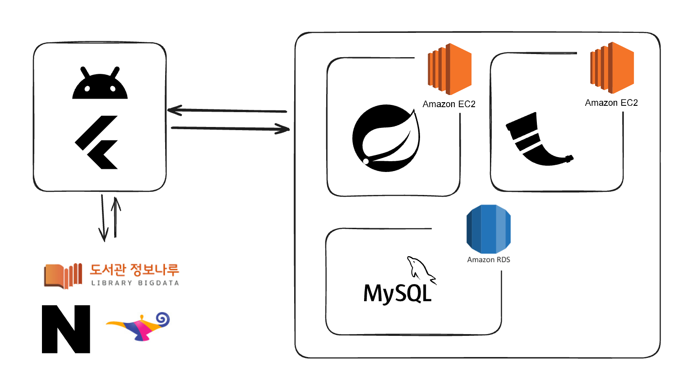

# 책키라웃 (CheckItOut) - 도서 추천 및 공공도서관 연계 서비스

- **Spring Boot 기반의 백엔드 REST API 서버**
- **배경**: 공공도서관의 낮은 장서 수와 방문자 수 문제를 해결하기 위해, 사용자에게 맞춤형 도서 추천과 통합 도서관 정보를 제공하는 애플리케이션 개발을 목표로 함

## 주요 기능

- **회원 관리**: JWT 기반 인증/인가, 이메일 회원가입/로그인, 사용자 권한 관리 (USER/ADMIN)
- **도서 서비스**: Flask AI 연동 맞춤 추천, 내 서재 관리(등록/삭제/조회), 카테고리별 필터링
- **편의 기능**: 관심 공공도서관 즐겨찾기, 사용자 주소 관리

## 기술 스택

- **Backend**: Java 17, Spring Boot 3.2.5, Spring Data JPA, QueryDSL, Spring Security, JWT, Gradle
- **Database**: MySQL, Hibernate
- **Infra**: AWS EC2, AWS RDS (MySQL), Amazon Linux

## 아키텍처

## API 문서 (API Documentation)

- [Postman API Documentation](https://documenter.getpostman.com/view/32521050/2sAXjQ1AKk)

---

## 학술 성과 (프로젝트 연계 논문)

**KSC(Korean Software Congress) 2024 Poster Section 논문 Accept**

- **주제**: Spring Framework 캐싱 전략 성능 분석
- **관련 링크**: [Spring Framework 캐싱 최적화 전략 (RISS)](https://www.riss.kr/search/detail/DetailView.do?p_mat_type=1a0202e37d52c72d&control_no=cd9dc3cecb211246b7998d826d417196&keyword=)

### 논문 작성 배경 및 동기

- 기존 다수의 레퍼런스에서 **Persistence Context(1차 캐시)**를 주요 성능 향상 수단으로 설명하는 것에 대해 의문을 가짐

- 1차 캐시의 본질적 설계 목적은 엔티티의 **동일성**(Identity) 보장과 생명주기 관리

    - 이를 통한 성능 이점은 동일 트랜잭션 내 PK 조회와 같은 제한적인 조건에서 발생하는 부수적 효과일 수도 있지 않나 라는 생각을 가짐

- **연구 목표**: 실제 부하 테스트를 통해 1차 캐시의 성능 기여도 파악, 분석

### 2. 핵심 요약 (Key Findings)

*   **Insert 쿼리 성능:** Data JPA가 JPQL 대비 약 **20%** 성능 우수.
    *   실험 데이터(238.0 vs 197.8)에 따르면 약 1.2배(20%) 향상
*   **Select 쿼리 성능:** Spring 내장 Cache Manager 사용 시, 기존 Data JPA 대비 약 **5.75배**의 Throughput 성능 향상.

### 3. 상세 성능 분석 및 원인

#### 3.1 Insert 로직 성능 비교 (Data JPA vs. JPQL)

| 구분                | JPQL Logic | Spring Data JPA Logic | 비고                      |
| :------------------ | :--------- | :-------------------- | :------------------------ |
| **Throughput/sec**  | 197.8 /sec | **238.0 /sec**        | Data JPA가 약 20% 더 빠름 |
| **Received KB/sec** | 93.48      | 112.48                |                           |
| **Sent KB/sec**     | 97.35      | 116.90                |                           |

> **성능 차이 원인 분석:**
> 두 로직의 실행 순서와 종류는 동일했으나, Data JPA의 영속성 컨텍스트 기반 **쓰기 지연(Write-behind)** 메커니즘이 성능 차이를 결정한 것으로 예상.
>
> - **쓰기 지연 (Transactional Write-behind)**
    >   -  INSERT 쿼리를 즉시 실행하지 않고 영속성 컨텍스트(1차 캐시)의 쓰기 지연 SQL 저장소에 적재함
>
>   - 트랜잭션 종료 시점에 쿼리를 모아서 전송하여 네트워크 왕복 횟수(Network Round-trip)를 최소화함.
>
> - **JDBC 배치 최적화 (Batch Insert)**: 1차 캐시에 보관된 엔티티들을 JDBC 수준의 배치 처리를 통해 한 번의 네트워크 요청으로 병합 전송함. 반복적인 INSERT 작업에서 발생하는 네트워크 및 드라이버 오버헤드를 물리적으로 감소.
>
> - **영속성 컨텍스트의 효율적 관리**: 1차 캐시를 통해 엔티티의 상태를 추적하고 불필요한 DB 통신을 억제하여 전체적인 처리량(Throughput)을 향상시킴.

#### 3.2 Select 로직 성능 비교 (Cache Manager vs. Data JPA)

*   **테스트 조건:** 200 Threads, 5 Loop count

| 구분                | Data JPA Logic | Use Cache Manager Logic | 성능 향상 배수 |
| :------------------ | :------------- | :---------------------- | :------------- |
| **Throughput/sec**  | 172.2 /sec     | **991.1 /sec**          | **약 5.75배**  |
| **Received KB/sec** | 126.46         | **727.82**              |                |
| **Sent KB/sec**     | 79.21          | **456.83**              |                |

> **성능 차이 원인 분석:**
> Spring 내장 Cache Manager를 활용함으로써 다음과 같은 이점을 얻음
>
> 1.  **In-Memory Caching:** 초기 조회 데이터를 메모리에 캐싱하여 후속 요청 시 DB 접근을 차단하고 재사용
> 2.  **리소스 절약:** 디스크 I/O 연산 및 DB 쿼리 실행에 필요한 컴퓨팅 리소스 소비 감소
> 3.  **네트워크 효율:** DB와의 통신이 줄어들어 네트워크 레이턴시 등 시스템 부하 요소 감소

### 4. 실험 환경 (Test Environment)

#### 4.1 데이터베이스 (Database)

*   **DBMS:** Amazon RDS for MySQL
*   **인스턴스 타입:** AWS T4g 계열 (Arm 기반 Graviton 2 프로세서)
    *   *클라우드 환경에서 관리형 DB로 구동*

#### 4.2 애플리케이션 서버

*   **Runtime:** Java 17
*   **Framework:** Spring Boot 3.2.5
*   **Hardware (Host):** Intel i7-1195G7 CPU / 16GB RAM
    *   *요청을 처리한 환경*

#### 4.3 테스트 및 분석 도구

*   **부하 테스트 도구:** Apache JMeter (200 Threads, 5 Loop 설정)
*   **모니터링:** AOP를 활용한 메소드 레벨 로그 분석 및 실행 시간 측정
*   **측정 지표:**
    *   **Throughput/sec:** 초당 처리량
    *   **Received/Sent KB/sec:** 데이터 송수신량
    *   **Latency:** 응답 지연 시간

